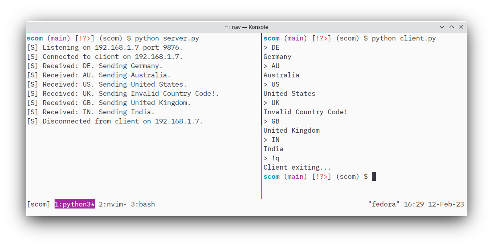

# Secure Communication (scom)
Encrypted communication between two processes through network sockets.

scom uses RSA keys to encrypt a session key before sending it to the clients.
The session key is then used to perfom AES encryption on every message that is exchanged between the servers and the clients.
The communication occurs through TCP sockets.

## Installation
The required dependencies for scom can be installed via the `pipenv`.
In the project root run:
```shell
pipenv install
```

## Running
To see scom in action, the server and the clients must be started separately.
Running them is as simple as invoking the client and the server scripts with python as `python server.py` and `python client.py`.

## Screenshot

